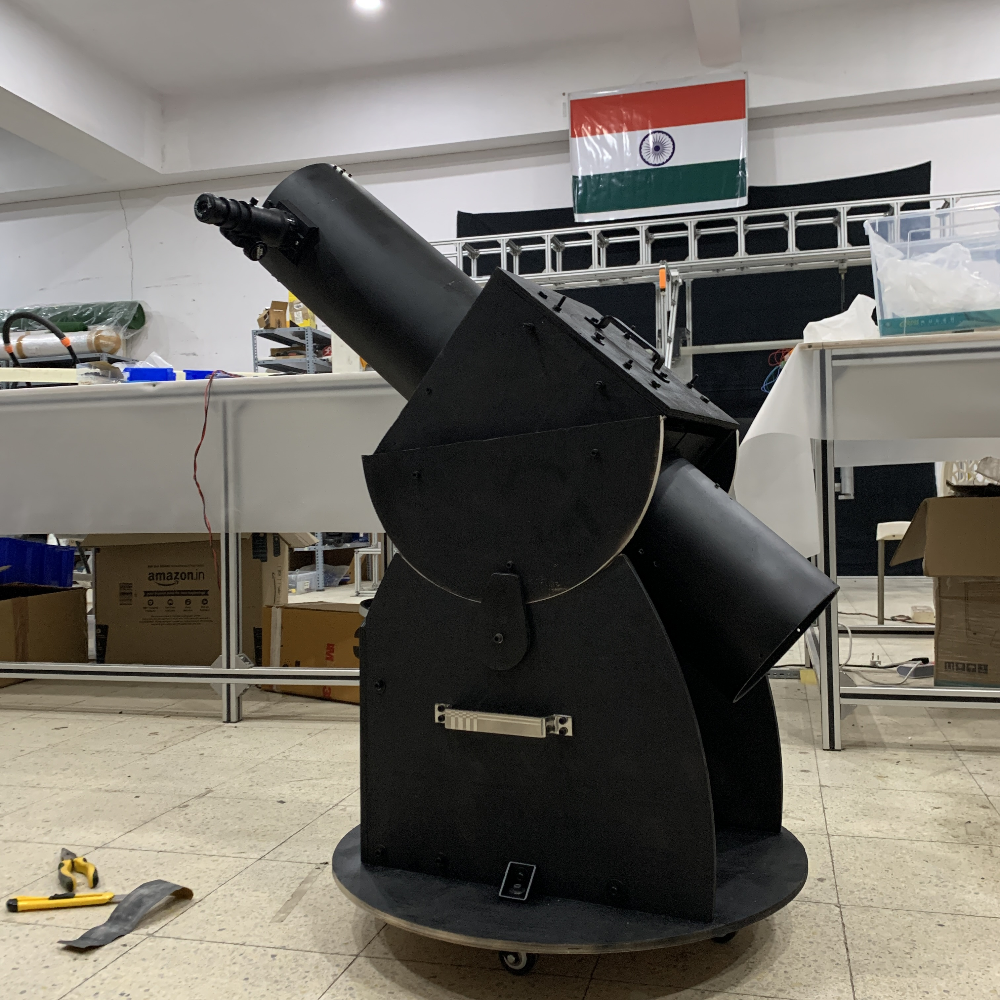
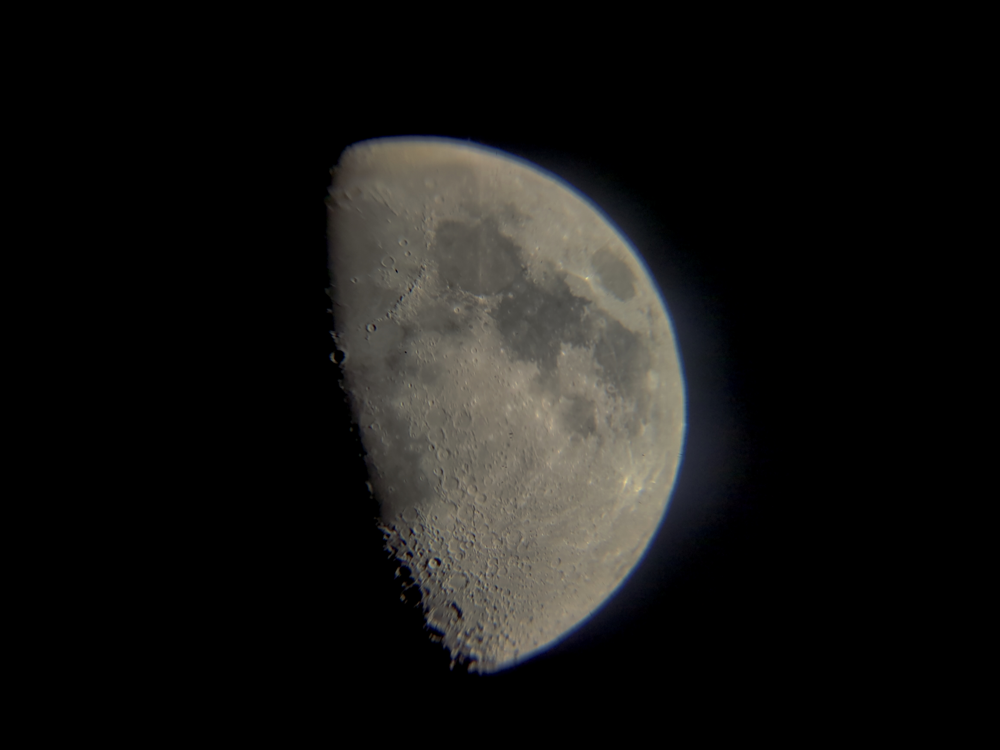
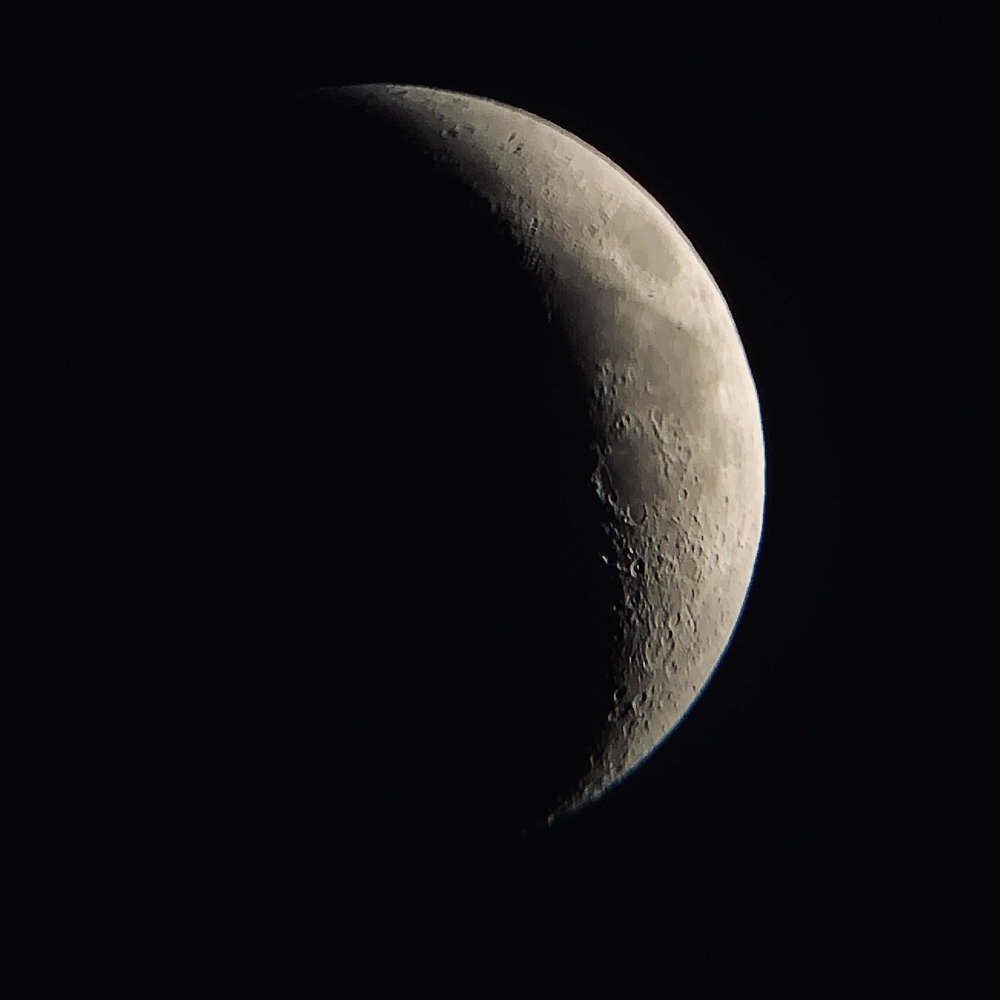
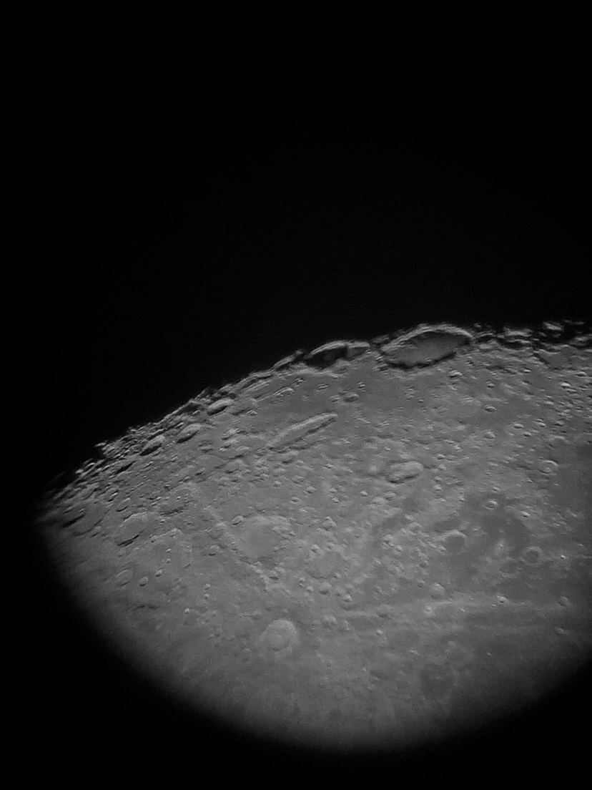
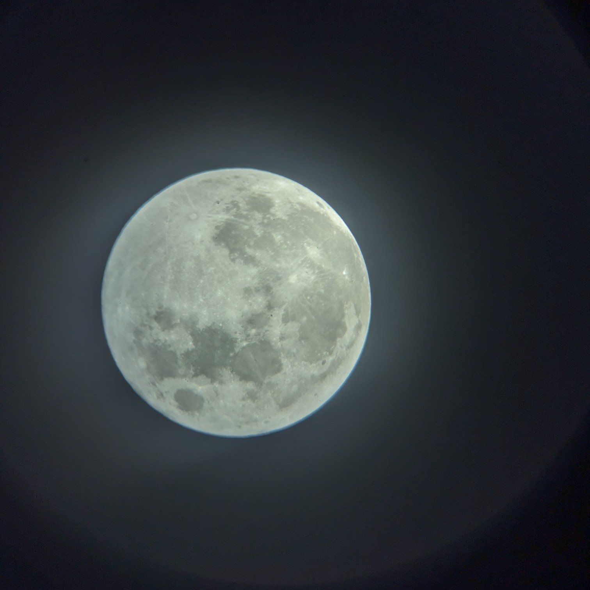
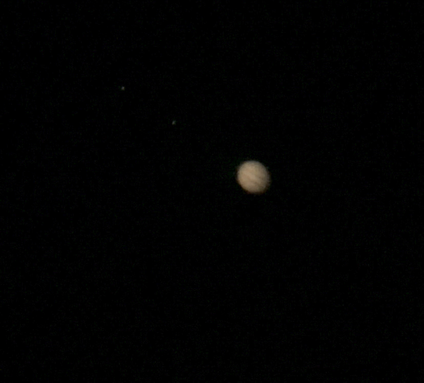
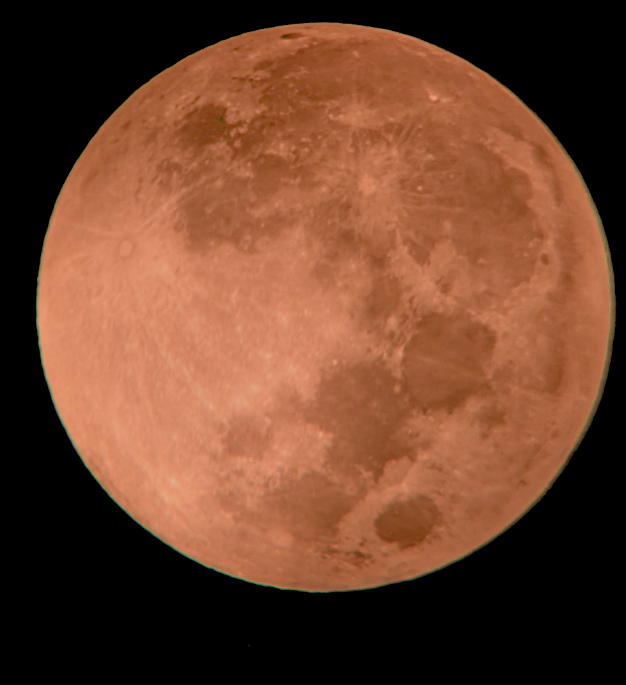
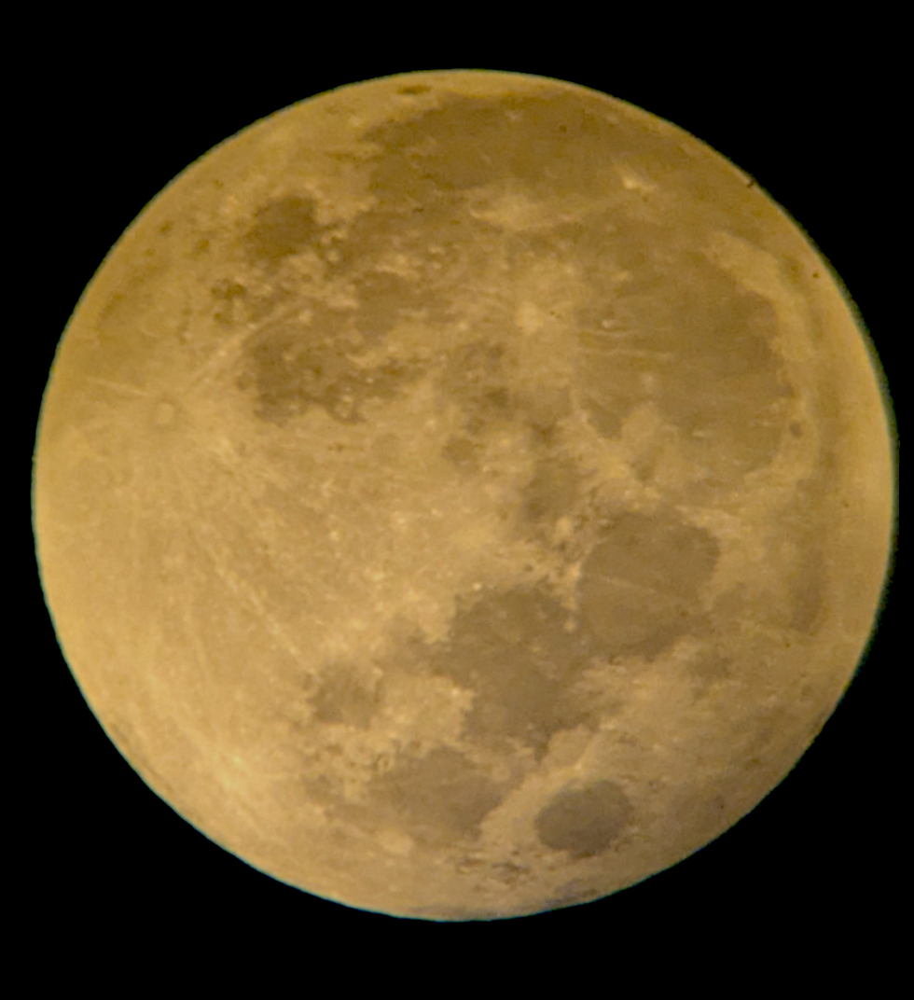
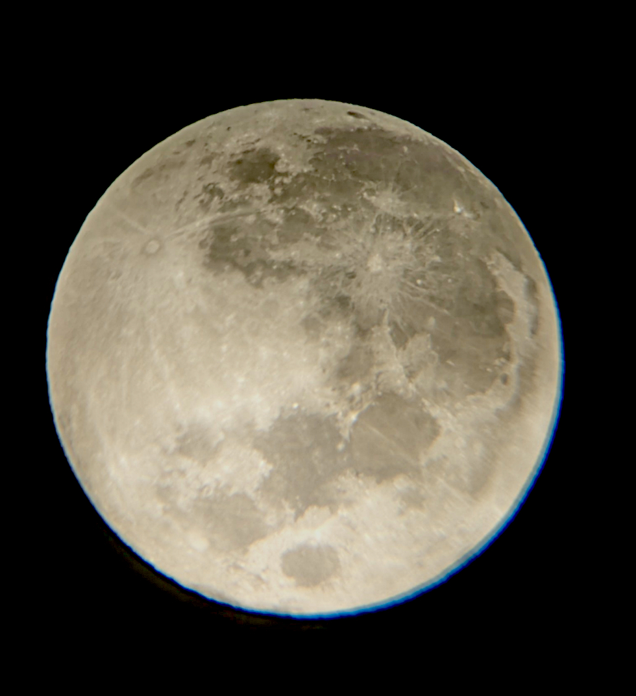

# Curiosity Telescope 🔭

*“As is the Individual, so is the Universe, as is the Universe, so is the Individual”*  
derived from the shloka || यथा पिण्डे तथा ब्रह्माण्डे, यथा ब्रह्माण्डे तथा पिण्डे ||

## Mission & Introduction

Mission CURIOSITY: On a hunt to find the Meaning!  
Inspired by Reddit astrophotography and Richard Berry’s *Build Your Own Telescope* (1985), Madhav and Swarup set out to construct a **6‑inch f/6 Newtonian reflector with a Dobsonian mount** in Bengaluru, India. The clear winter skies (Oct–Mar) made the project practical—and affordable compared with commercial scopes. Hence the name **“CURIOSITY”**.

*After final assembly – 10 Jan 2026*

### Design summary

- **Primary mirror** Ø150 mm (6")  
- **Focal length** 900 mm (f/6)  
- **Secondary mirror** 28×38 mm  
- **Eyepieces** 25 mm and 9 mm (+2× Barlow)  
- **PVC tube** Ø190 mm × 1000 mm, painted matte black  

> “CURIOSITY” was built with off‑the‑shelf optics from [Tejraj](https://www.tejraj.com/product/6-newtonian-telescope-making-optical-kit) and custom‑fabricated mechanical parts.

---

## CAD modelling & 3‑D parts

Design and assembly were modelled in **Fusion 360** (student license).  
All CAD components are available on GrabCAD:

[Curiosity 6" Newtonian Reflector Dobsonian Telescope](https://grabcad.com/library/curiosity-6-newtonian-reflector-dobsonian-telescope-1)

---

### Learning the sky

- **Planisphere**: dial to date/time to view sky.
- **Apps:**
  - *iOS*: Stellarium, SkyGuide, Sky Academy
  - *Android*: Stellarium, Spot The Station, Sky Academy, Look4Sat, Heavens‑Above

---

## Gallery

<table>
<tr>
<td></td>
<td></td>
<td></td>
</tr>
<tr>
<td></td>
<td></td>
<td></td>
</tr>
<tr>
<td></td>
<td></td>
<td></td>
</tr>
</table>

---

